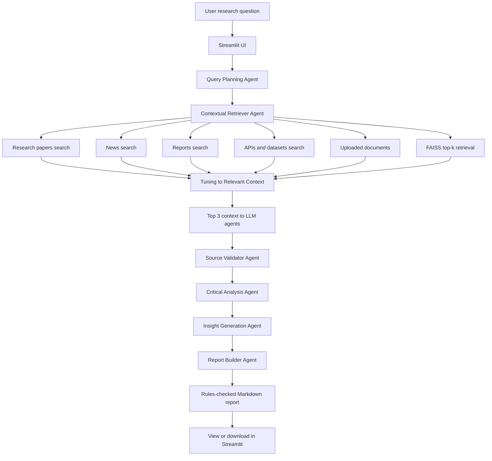

# Multi-Agent AI Deep Researcher

An AI-powered research assistant for multi-hop, multi-source investigations.
The app coordinates specialized agents with LangGraph, retrieves relevant
context through FAISS, searches the web with Tavily, and presents a structured
research report in Streamlit.

## What it demonstrates

- **Agent collaboration** with a LangGraph state machine.
- **Parallel contextual retrieval** from Tavily source lanes and uploaded local documents.
- **Retrieval augmented synthesis** using FAISS and LangChain document utilities.
- **Critical analysis** that flags source credibility, caveats, and contradictions.
- **Insight generation** for hypotheses, trends, and follow-up questions.
- **Report building** into a citation-oriented Markdown research report.
- **Cached YAML system prompts** with explicit agent roles.
- **Offline demo fallback** when API keys are unavailable.

## Agent team

1. **Query Planning Agent** decomposes the topic into multi-hop sub-questions.
2. **Contextual Retriever Agent** runs Tavily searches in parallel across
   research papers, news articles, reports, and APIs. It adds uploaded files,
   runs configurable FAISS top-k retrieval, then tunes all source signals into
   relevant context for LLM agents. The default top-k is 3.
3. **Source Validator Agent** validates the top retrieved results with the LLM
   and heuristic provenance checks. The default validator top-k is 3.
4. **Critical Analysis Agent** summarizes findings, contradictions, and source
   quality with a configurable 200-word default limit.
5. **Insight Generation Agent** proposes hypotheses and trends with a
   configurable 200-word default limit.
6. **Report Builder Agent** compiles a 200-300 word Markdown report and enforces
   human-tone, hook, source-link, and formatting rules.

## Simple flow diagram



## Tech stack

- Python
- Streamlit UI
- LangGraph for orchestration
- LangChain document, model, and vector interfaces
- FAISS vector database
- Tavily web search
- OpenAI chat and embedding models when configured
- YAML system prompts loaded with process-level caching

## Hackathon concept alignment

The accelerator concept list is stored in `src/deep_researcher/concepts.json`.
The app loads it at runtime and maps each concept to implementation evidence in
`src/deep_researcher/concepts.py`.

Current computed concept alignment:

- **Concept Score:** 7.2/10
- **Implemented concepts:** 10/18
- **Partial concepts:** 6/18
- **Not targeted concepts:** 2/18

Open the Streamlit sidebar section **Hackathon concept alignment** to view the
full evidence table and next improvements for each concept.

## Quick start

```bash
python -m venv .venv
source .venv/bin/activate
pip install -r requirements.txt
cp .env.example .env
```

Edit `.env` and add keys if available:

```bash
OPENAI_API_KEY=your_openai_key
TAVILY_API_KEY=your_tavily_key
LLM_PROVIDER=openai
OPENAI_BASE_URL=
OPENAI_MODEL=gpt-4o-mini
MAX_WEB_RESULTS=8
MAX_RETRIEVAL_DOCS=3
VALIDATOR_TOP_K=3
CRITICAL_ANALYSIS_WORD_LIMIT=200
INSIGHT_WORD_LIMIT=200
REPORT_MIN_WORDS=200
REPORT_MAX_WORDS=300
```

For OpenRouter, use an OpenRouter key and these settings:

```bash
OPENAI_API_KEY=your_openrouter_key
LLM_PROVIDER=openrouter
OPENAI_BASE_URL=https://openrouter.ai/api/v1
OPENAI_MODEL=openai/gpt-4o-mini
```

Run the app:

```bash
streamlit run streamlit_app.py
```

The UI also lets you select the API provider, switch base URLs, choose the
model, and paste keys into the sidebar for a one-off session.

## Windows install at `G:\Outskill\Hackathon\DeepAIResearch`

Clone or copy this repository to:

```powershell
G:\Outskill\Hackathon\DeepAIResearch
```

Then run PowerShell:

```powershell
Set-ExecutionPolicy -Scope Process -ExecutionPolicy Bypass
cd G:\Outskill\Hackathon\DeepAIResearch
.\scripts\install_windows.ps1
```

To install and launch Streamlit in one command:

```powershell
.\scripts\install_windows.ps1 -Run
```

After installation, start the app anytime with:

```powershell
cd G:\Outskill\Hackathon\DeepAIResearch
.\.venv\Scripts\streamlit.exe run streamlit_app.py
```

## Running without API keys

The project is still usable for demos without keys:

- Tavily search is replaced by a clear system notice.
- FAISS retrieval works with deterministic local hash embeddings.
- Report synthesis falls back to extractive local reasoning.
- Upload `.txt`, `.md`, or `.pdf` files to provide source material.

Configure `OPENAI_API_KEY` and `TAVILY_API_KEY` for the complete multi-source
web research experience.

## Tests

```bash
pytest
```

## Project layout

```text
.
├── streamlit_app.py
├── requirements.txt
├── pyproject.toml
├── scripts/
│   └── install_windows.ps1
├── src/deep_researcher/
│   ├── agents.py
│   ├── concepts.json
│   ├── concepts.py
│   ├── config.py
│   ├── embeddings.py
│   ├── llm.py
│   ├── models.py
│   ├── prompts.py
│   ├── retrieval.py
│   ├── search.py
│   ├── system_prompts.yaml
│   └── workflow.py
└── tests/
    └── test_offline_workflow.py
```
