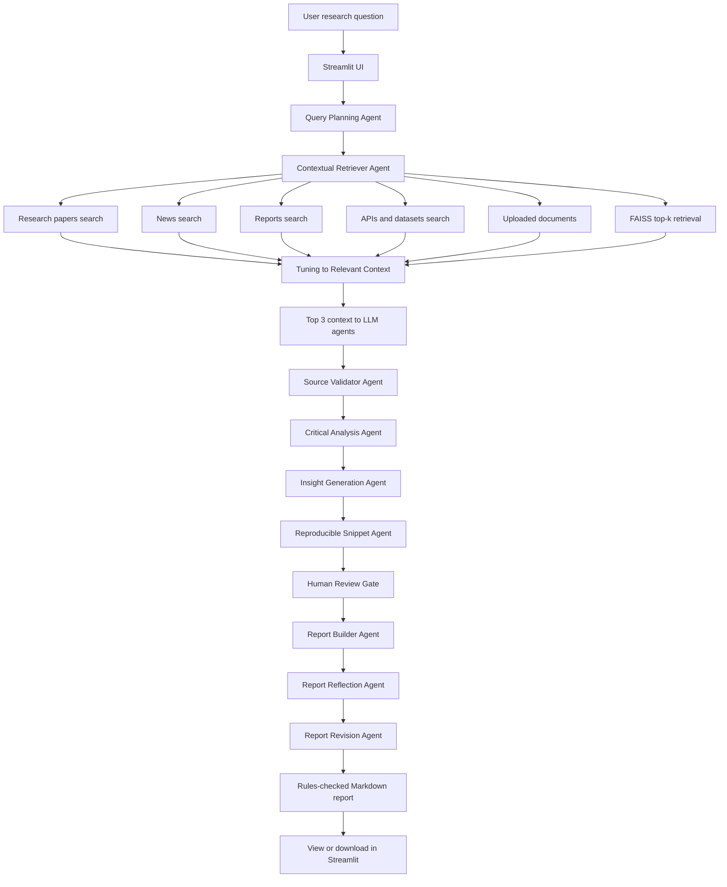

# Multi-Agent AI Deep Researcher

An AI-powered research assistant for multi-hop, multi-source investigations.
The app coordinates specialized agents with LangGraph, retrieves relevant
context through FAISS, searches the web with Tavily, and presents a structured
research report in Streamlit.

## What it demonstrates

- **Agent collaboration** with a LangGraph state machine.
- **Parallel contextual retrieval** from Tavily source lanes and uploaded local documents.
- **Retrieval augmented synthesis** using FAISS and LangChain document utilities.
- **Critical analysis** that flags source credibility, caveats, and contradictions.
- **Insight generation** for hypotheses, trends, and follow-up questions.
- **Reproducible Python snippets** for source counts and evidence checklists.
- **Report building** into a citation-oriented Markdown research report.
- **Cached YAML system prompts** with explicit agent roles.
- **Safe tool registry** for allowlisted Tavily, FAISS, and Markdown export tools.
- **MemorySaver checkpointing** with configurable thread IDs.
- **Offline demo fallback** when API keys are unavailable.

## Agent team

1. **Query Planning Agent** decomposes the topic into multi-hop sub-questions.
2. **Contextual Retriever Agent** runs Tavily searches in parallel across
   research papers, news articles, reports, and APIs. It adds uploaded files,
   runs configurable FAISS top-k retrieval, then tunes all source signals into
   relevant context for LLM agents. The default top-k is 3.
3. **Source Validator Agent** validates the top retrieved results with the LLM
   and heuristic provenance checks. The default validator top-k is 3.
4. **Critical Analysis Agent** summarizes findings, contradictions, and source
   quality with a configurable 200-word default limit.
5. **Insight Generation Agent** proposes hypotheses and trends with a
   configurable 200-word default limit.
6. **Reproducible Snippet Agent** creates optional notebook-ready Python for
   source counts and evidence checklist reproduction.
7. **Human Review Gate** can pause before report generation with LangGraph
   interrupts when enabled, and auto-approves by default for demos.
8. **Report Builder Agent** compiles a 200-300 word Markdown report and enforces
   human-tone, hook, source-link, and formatting rules.
9. **Report Reflection Agent** validates report rules with a configurable retry
   limit and applies deterministic fixes.
10. **Report Revision Agent** applies targeted inline edits to Markdown sections
   such as the hook, body guardrails, and `## SOURCES`.

## Simple flow diagram



## Tech stack

- Python
- Streamlit UI
- LangGraph for orchestration
- LangChain document, model, and vector interfaces
- FAISS vector database
- Tavily web search
- OpenAI chat and embedding models when configured
- YAML system prompts loaded with process-level caching

## Hackathon concept alignment

The accelerator concept list is stored in `src/deep_researcher/config/concepts.json`.
The app loads it at runtime and maps each concept to implementation evidence in
`src/deep_researcher/config/concepts.py`.

Current computed concept alignment:

- **Concept Score:** 9.7/10
- **Implemented concepts:** 16/17
- **Partial concepts:** 1/17
- **Not targeted concepts:** 0/17

Open the Streamlit sidebar section **Hackathon concept alignment** to view the
full evidence table and next improvements for each concept.

| Concept | Pattern | Importance | Status | Evidence | Next improvement |
|---|---|---|---|---|---|
| 1.1 LLM Setup | Model Initialization | Critical | Implemented | ResearchLLM initializes ChatOpenAI with OpenAI/OpenRouter/custom provider config and temperature. | Expose more model hyperparameters such as max tokens and top-p. |
| 1.2 Tools & Shell Command Execution | Tool Use | High | Implemented | SafeToolRegistry allowlists Tavily search, FAISS retrieval, and Markdown export tools for agent execution. | Add per-tool audit logs and user-visible tool invocation metadata. |
| 1.3 Agent Graph & Smart Routing | Routing | Critical | Implemented | DeepResearchWorkflow builds a LangGraph node network for planner, retriever, validator, analysis, insights, and report builder. | Add conditional edges for retry or skip behavior based on state quality. |
| 1.4 Structured Planning | Planning | High | Implemented | Query Planning Agent returns a typed ResearchPlan Pydantic object with sub-questions, focus areas, and evidence needs. | Add provider-native with_structured_output when live LLM providers support it. |
| 1.6 System Prompt | Persona & Constraint Management | High | Implemented | System prompts are centralized in `src/deep_researcher/config/system_prompts.yaml` with explicit roles and runtime placeholders. | Add prompt version metadata and per-agent prompt tests. |
| 1.7 Streaming | UX Event Streaming | Medium | Implemented | DeepResearchWorkflow.stream emits graph node updates that Streamlit renders step by step. | Add token-level streaming when provider APIs support it. |
| 1.8 Multi Turn Conversation | Session Memory | Medium | Partial | Streamlit session_state stores the last report and state for a session, but durable conversation memory is not implemented. | Persist research sessions and allow follow-up questions over prior state. |
| 2.1 Structured Output & File Generation | Structured Output + State | High | Implemented | Pydantic models and TypedDict state define source documents, assessments, and workflow state. | Use structured LLM output for planner and source validation responses. |
| 2.2 AI Code Review with Retry Limit | Reflection + Exception Handling | High | Implemented | Report Reflection Agent validates report rules and applies deterministic fixes with a configurable retry counter. | Add LLM-generated critique messages for each failed validation rule. |
| 2.3 Dynamic Rules | Dynamic Guardrails | Medium | Implemented | Report word limits, top-k limits, provider selection, and report guardrails are config-driven and state-aware. | Allow users to choose different report rule profiles from the UI. |
| 2.4 Inline Edit | Targeted Delta Patches | Medium | Implemented | Report Revision Agent applies targeted Markdown edits to the opening hook, body guardrails, and ## SOURCES section after report generation. | Expose user-selected revision targets such as hook-only, sources-only, or length-only edits. |
| 3.1 Codebase RAG & Semantic Code Search | Knowledge Retrieval | High | Implemented | FAISS retrieval indexes uploaded documents and Tavily results for grounded context selection. | Add optional repository/code indexing for technical research tasks. |
| 3.2 Orchestrator State | State Orchestration | Critical | Implemented | ResearchState carries sub-questions, sources, tuned context, assessments, synthesis, insights, report, and logs across agents. | Persist state snapshots for comparison across runs. |
| 3.3 Multi-Agent Code Generation per File | Multi-Agent | Critical | Implemented | Specialized LangGraph nodes divide scope across planning, retrieval, validation, analysis, insight generation, and reporting. | Add a dedicated contradiction matrix agent. |
| 3.4 Human Approval Gate | Human-in-the-Loop | High | Implemented | Human Review Gate runs before Report Builder and can use LangGraph interrupt when REQUIRE_HUMAN_REVIEW is enabled. | Add Streamlit resume controls for interactive interrupt approval. |
| 3.5 Parallel File Generation | Parallelization | Medium | Implemented | Contextual Retriever runs parallel Tavily source lanes for papers, news, reports, and APIs before merging sources. | Use LangGraph Send/reducers for graph-native parallel branches. |
| 3.6 State Checkpointing & Time Travel | Memory Management | Medium | Implemented | DeepResearchWorkflow compiles with MemorySaver and invokes/streams with configurable thread IDs. | Add a UI history browser for replaying checkpointed thread states. |

### Recently implemented next-level improvements

| Concept | Requested improvement | Implementation evidence |
|---|---|---|
| 1.2 Tools & Shell Command Execution | Add an explicit safe tool registry for source fetchers or report exporters. | `src/deep_researcher/tools/registry.py` defines `SafeToolRegistry` with allowlisted `parallel_tavily_search`, `faiss_top_k_retrieval`, and `markdown_report_export` tools. |
| 1.4 Structured Planning | Return a typed Pydantic planning object from the planner agent. | `ResearchPlan` in `src/deep_researcher/main/models.py` carries `sub_questions`, `focus_areas`, and `evidence_needs`; Query Planning Agent stores it in workflow state. |
| 2.2 AI Code Review with Retry Limit | Add a reflection node with retry counters for report validation failures. | `Report Reflection Agent` validates report rules after Report Builder and uses `REPORT_REFLECTION_RETRY_LIMIT` for retry control. |
| 3.4 Human Approval Gate | Add a review gate before Report Builder using LangGraph interrupts. | `Human Review Gate` runs before Report Builder and calls LangGraph `interrupt` when `REQUIRE_HUMAN_REVIEW=true`; it auto-approves by default for demos. |
| 3.6 State Checkpointing & Time Travel | Add MemorySaver checkpointer and thread IDs for replayable research runs. | `DeepResearchWorkflow` compiles with `MemorySaver` and runs with configurable `CHECKPOINT_THREAD_ID`. |

## Quick start

```bash
python -m venv .venv
source .venv/bin/activate
pip install -r requirements.txt
cp src/deep_researcher/config/.env.example .env
```

Edit `.env` and add keys if available:

```bash
OPENAI_API_KEY=your_openai_key
TAVILY_API_KEY=your_tavily_key
LLM_PROVIDER=openai
OPENAI_BASE_URL=
OPENAI_MODEL=gpt-4o-mini
MAX_WEB_RESULTS=8
MAX_RETRIEVAL_DOCS=3
VALIDATOR_TOP_K=3
CRITICAL_ANALYSIS_WORD_LIMIT=200
INSIGHT_WORD_LIMIT=200
REPORT_MIN_WORDS=200
REPORT_MAX_WORDS=300
GENERATE_CODE_SNIPPET=true
REPORT_REFLECTION_RETRY_LIMIT=2
REQUIRE_HUMAN_REVIEW=false
CHECKPOINT_THREAD_ID=deep-research-default
```

For OpenRouter, use an OpenRouter key and these settings:

```bash
OPENAI_API_KEY=your_openrouter_key
LLM_PROVIDER=openrouter
OPENAI_BASE_URL=https://openrouter.ai/api/v1
OPENAI_MODEL=openai/gpt-4o-mini
```

Run the app:

```bash
streamlit run src/deep_researcher/main/streamlit_app.py
```

The UI also lets you select the API provider, switch base URLs, choose the
model, and paste keys into the sidebar for a one-off session.

## Windows install at `G:\Outskill\Hackathon\DeepAIResearch`

Clone or copy this repository to:

```powershell
G:\Outskill\Hackathon\DeepAIResearch
```

Then run PowerShell:

```powershell
Set-ExecutionPolicy -Scope Process -ExecutionPolicy Bypass
cd G:\Outskill\Hackathon\DeepAIResearch
.\scripts\install_windows.ps1
```

To install and launch Streamlit in one command:

```powershell
.\scripts\install_windows.ps1 -Run
```

After installation, start the app anytime with:

```powershell
cd G:\Outskill\Hackathon\DeepAIResearch
.\.venv\Scripts\streamlit.exe run src\deep_researcher\main\streamlit_app.py
```

## Running without API keys

The project is still usable for demos without keys:

- Tavily search is replaced by a clear system notice.
- FAISS retrieval works with deterministic local hash embeddings.
- Report synthesis falls back to extractive local reasoning.
- Upload `.txt`, `.md`, or `.pdf` files to provide source material.

Configure `OPENAI_API_KEY` and `TAVILY_API_KEY` for the complete multi-source
web research experience.

## Tests

```bash
pytest
```

## Project layout

```text
.
├── requirements.txt
├── pyproject.toml
├── scripts/
│   └── install_windows.ps1
├── src/deep_researcher/
│   ├── agent/
│   │   ├── agents.py
│   │   ├── llm.py
│   │   └── prompts.py
│   ├── config/
│   │   ├── .env.example
│   │   ├── concepts.json
│   │   ├── concepts.py
│   │   ├── system_prompts.yaml
│   │   └── settings.py
│   ├── main/
│   │   ├── models.py
│   │   ├── streamlit_app.py
│   │   └── workflow.py
│   └── tools/
│       ├── embeddings.py
│       ├── registry.py
│       ├── retrieval.py
│       └── search.py
└── tests/
    └── test_offline_workflow.py
```
