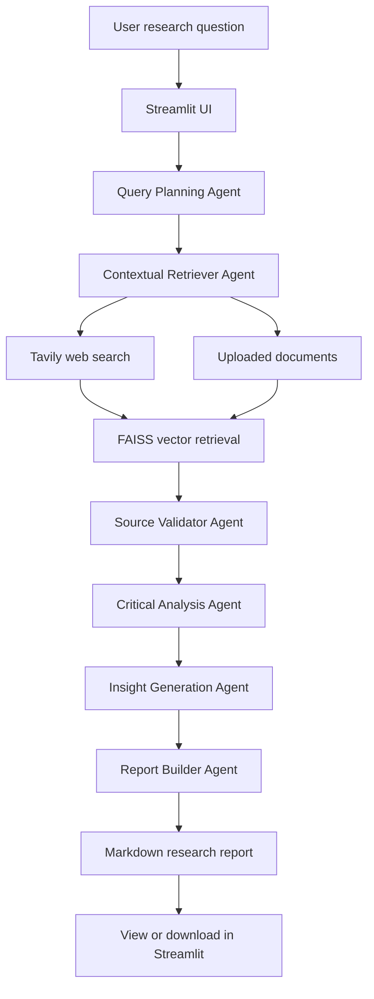

# Multi-Agent AI Deep Researcher

An AI-powered research assistant for multi-hop, multi-source investigations.
The app coordinates specialized agents with LangGraph, retrieves relevant
context through FAISS, searches the web with Tavily, and presents a structured
research report in Streamlit.

## What it demonstrates

- **Agent collaboration** with a LangGraph state machine.
- **Contextual retrieval** from Tavily web results and uploaded local documents.
- **Retrieval augmented synthesis** using FAISS and LangChain document utilities.
- **Critical analysis** that flags source credibility, caveats, and contradictions.
- **Insight generation** for hypotheses, trends, and follow-up questions.
- **Report building** into a citation-oriented Markdown research report.
- **Offline demo fallback** when API keys are unavailable.

## Agent team

1. **Query Planning Agent** decomposes the topic into multi-hop sub-questions.
2. **Contextual Retriever Agent** pulls web data with Tavily and local uploaded
   files, then selects relevant chunks with FAISS.
3. **Source Validator Agent** rates credibility, relevance, and caveats.
4. **Critical Analysis Agent** summarizes findings and highlights contradictions.
5. **Insight Generation Agent** proposes hypotheses and emerging trends.
6. **Report Builder Agent** compiles a structured Markdown report.

## Simple flow diagram



## Tech stack

- Python
- Streamlit UI
- LangGraph for orchestration
- LangChain document, model, and vector interfaces
- FAISS vector database
- Tavily web search
- OpenAI chat and embedding models when configured

## Quick start

```bash
python -m venv .venv
source .venv/bin/activate
pip install -r requirements.txt
cp .env.example .env
```

Edit `.env` and add keys if available:

```bash
OPENAI_API_KEY=your_openai_key
TAVILY_API_KEY=your_tavily_key
OPENAI_MODEL=gpt-4o-mini
```

Run the app:

```bash
streamlit run streamlit_app.py
```

The UI also lets you paste API keys into the sidebar for a one-off session.

## Windows install at `G:\Outskill\Hackathon\DeepAIResearch`

Clone or copy this repository to:

```powershell
G:\Outskill\Hackathon\DeepAIResearch
```

Then run PowerShell:

```powershell
Set-ExecutionPolicy -Scope Process -ExecutionPolicy Bypass
cd G:\Outskill\Hackathon\DeepAIResearch
.\scripts\install_windows.ps1
```

To install and launch Streamlit in one command:

```powershell
.\scripts\install_windows.ps1 -Run
```

After installation, start the app anytime with:

```powershell
cd G:\Outskill\Hackathon\DeepAIResearch
.\.venv\Scripts\streamlit.exe run streamlit_app.py
```

## Running without API keys

The project is still usable for demos without keys:

- Tavily search is replaced by a clear system notice.
- FAISS retrieval works with deterministic local hash embeddings.
- Report synthesis falls back to extractive local reasoning.
- Upload `.txt`, `.md`, or `.pdf` files to provide source material.

Configure `OPENAI_API_KEY` and `TAVILY_API_KEY` for the complete multi-source
web research experience.

## Tests

```bash
pytest
```

## Project layout

```text
.
├── streamlit_app.py
├── requirements.txt
├── pyproject.toml
├── scripts/
│   └── install_windows.ps1
├── src/deep_researcher/
│   ├── agents.py
│   ├── config.py
│   ├── embeddings.py
│   ├── llm.py
│   ├── models.py
│   ├── retrieval.py
│   ├── search.py
│   └── workflow.py
└── tests/
    └── test_offline_workflow.py
```
